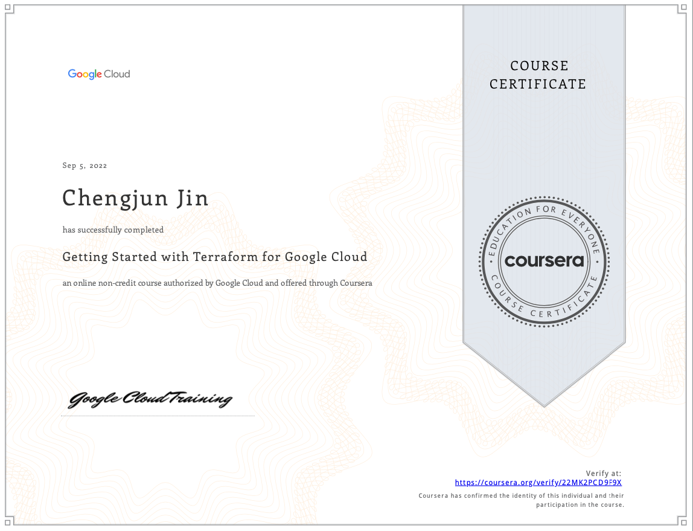

# Getting Started with Terraform for Google Cloud

This course provides an introduction to using Terraform for Google Cloud. It
enables learners to describe how Terraform can be used to implement
infrastructure as code and to apply some of its key features and
functionalities to create and manage Google Cloud infrastructure.

**Verified certificate:** [Check the online version
here](https://www.coursera.org/account/accomplishments/certificate/22MK2PCD9F9X)

